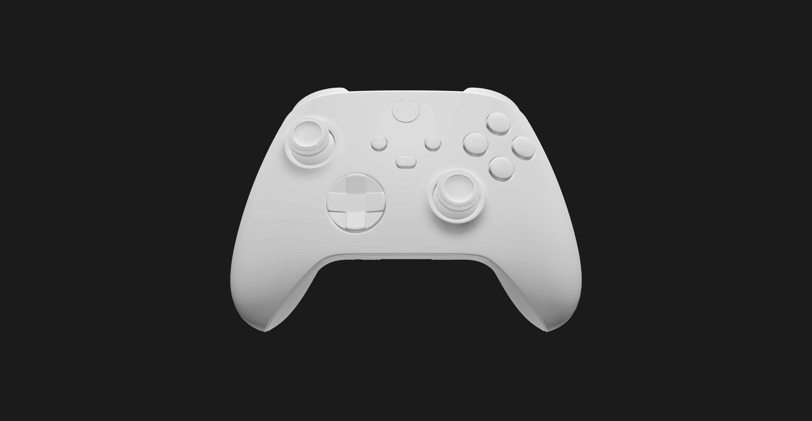
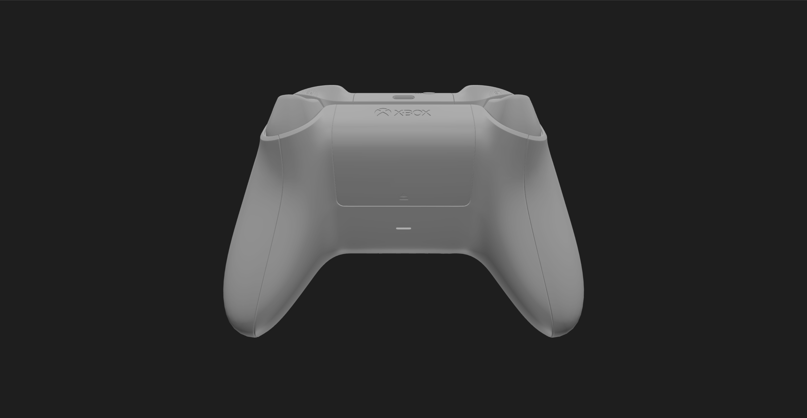
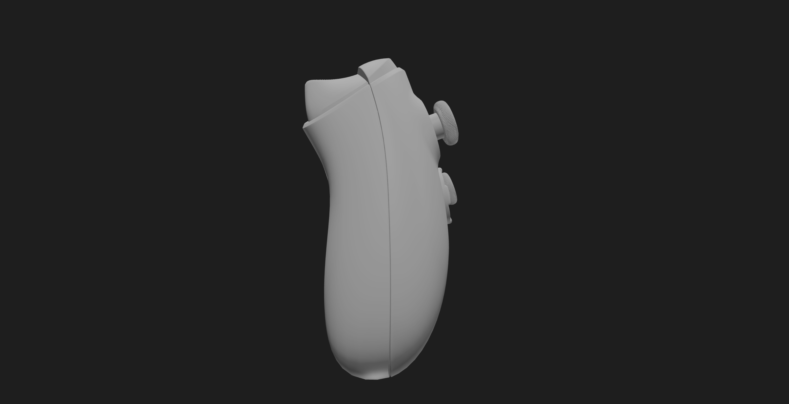
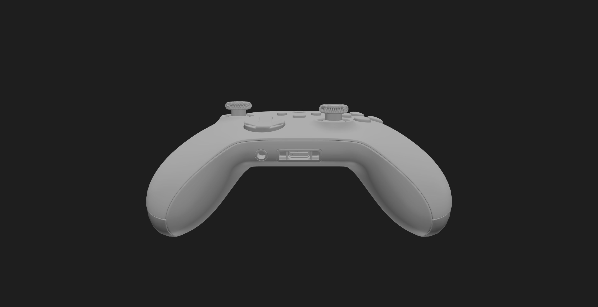

# 3D TV

> [!WARNING]
> This project is still in development and may not work as expected.



<div align="center">
   
   
   
</div>

---

<div align="center">
  <p align="center">
    A 3D model of the Xbox Wireless Controller made with Blender and rendered with React Three Fiber.
    <br />
    <a href="https://r3-f-xbox-wireless-controller.vercel.app/">View Demo</a>
    &middot;
    <a href="https://github.com/jeffrey-omega/R3F-Xbox-Wireless-Controller/issues/new?labels=bug">Report Bug</a>
    &middot;
    <a href="https://github.com/jeffrey-omega/R3F-Xbox-Wireless-Controller/issues/new?labels=enhancement">Request Feature</a>
  </p>
</div>

### Built With

- [Blender](https://www.blender.org/)
- [R3F-Vite-Starter-Template](https://github.com/jeffrey-omega/R3F-Vite-Starter-Template)

## Getting Started

### Prerequisites

> [!TIP]
> This project uses [pnpm](https://pnpm.io/) as package manager\
> If you don't use pnpm, you can replace `pnpm` with `npm` or `yarn` in the following commands.

### Installation

1. Clone the repo

   ```sh
   git clone https://github.com/jeffrey-omega/R3F-Xbox-Wireless-Controller.git
   ```

2. Navigate to the project directory
   ```sh
    cd R3F-Xbox-Wireless-Controller
   ```

3. Install pnpm packages
   ```sh
    pnpm install
   ```

### Run Locally

1. Start the development server
   ```sh
    pnpm dev
   ```
2. Build the project
   ```sh
    pnpm build
   ```
   
### :test_tube: Running Tests

To run tests, run the following command
```bash
  pnpm test
```

### Roadmap

> [!WARNING]
> This project is still in development and may not work as expected.
